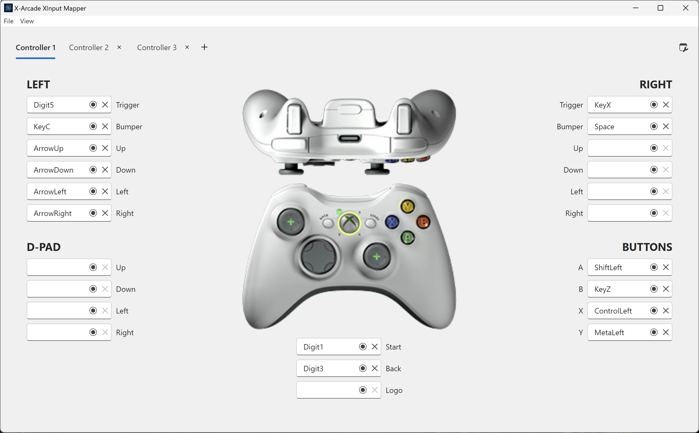

# X-Arcade XInput Mapper UI

UI for mapping conifguration files for [X-Arcade XInput](https://github.com/mikew/xarcade-xinput)

# Controller Inputs (XInput)

## LEFT

- LeftTrigger
- LeftBumper
- LeftStickY (Up)
- LeftStickYI (Down -1)
- LeftStickXI (Left -1)
- LeftStickX (Right)

## RIGHT

- RightTrigger
- RightBumper
- RightStickY (Up)
- RightStickYI (Down -1)
- RightStickXI (Left -1)
- RightStickX (Right)

## D-Pad

- Up
- Down
- Left
- Right

## BUTTONS

- A
- B
- X
- Y
- Start
- Back
- Logo
